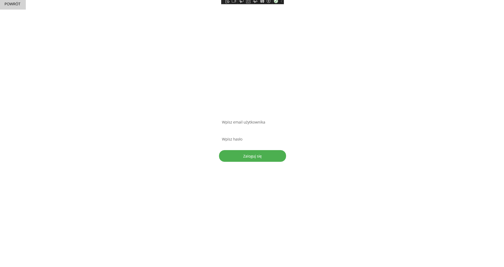

# 🚌 Bus Management App – .NET MAUI  
| 🌐 Documentation Languages |  
|---------------------------|  
| 🇬🇧 [English](README.md) |  
| 🇵🇱 [Polski](README-PL.md) |  
| 🇩🇪 [Deutsch](README-DE.md) |  
| 🇷🇺 [Русский](README-RU.md) |   
| 🇨🇳 [中文](README-ZH.md) |
| 🏰 [Sarmacki](README-SARMACKI.md) |
---

Project created as part of learning mobile app development using .NET MAUI. It allows user registration and login, role differentiation (admin/user), and bus route management (adding, editing, deleting).

---

## 📄 Full Documentation  
A complete, detailed documentation of the project is available here:  
[**View full documentation**](README-LONGER.md)

---

👉 [Click here to download the project (.rar) from MediaFire](https://www.mediafire.com/file/jiod1vuoa9j1ulv/projekt.rar/file)

---

## 📌 Table of Contents

- [📸 Screenshots](#-screenshots)
- [🔍 Features Overview](#-features-overview)
- [⚙️ Technologies](#️-technologies)
- [📁 Project Structure](#-project-structure)
- [🚀 Getting Started](#-getting-started)
- [🛠 Future Improvements](#-future-improvements)
- [👨‍💻 Authors](#-authors)
- [📄 License](#-license)

---

## 📸 Screenshots

  
  


---

## 🔍 Features Overview

### 👥 Registration and Login

- Register a new user with a role selection:
  - **User** – standard user access
  - **Admin** – has access to bus route management (requires a special code)
- Passwords are securely hashed using PBKDF2 + salt

### 🚍 Bus Management (Admin Panel)

- View list of existing bus routes
- Add a new route
- Edit route details: name, origin, destination, time, price
- Delete route (with confirmation)

### 👤 User Panel

- View available bus routes in a clean list format

---

## ⚙️ Technologies

- [.NET MAUI](https://learn.microsoft.com/en-us/dotnet/maui/)
- C#
- XAML (UI)
- SQLite (local data storage)
- PBKDF2 + Salt (secure password hashing)

---

## 📁 Project Structure

```
project/
│
├── Models/
│   ├── Bus.cs
│   └── User.cs
│
├── Pages/
│   ├── MainPage.xaml / .cs
│   ├── LoginPage.xaml / .cs
│   ├── RegisterPage.xaml / .cs
│   ├── AdminBusPage.xaml / .cs
│   └── UserPanelPage.xaml / .cs
│
├── Services/
│   ├── Database.cs
│   └── UserManager.cs
│
├── Resources/
│   └── (optional styles/images)
│
├── App.xaml
└── AppShell.xaml
```

---

## 🚀 Getting Started

### 1. Requirements

- Visual Studio 2022 or newer with **.NET MAUI** workload
- Android emulator or physical device with USB debugging
- Optional: SQLite viewer for inspecting local data

### 2. Steps

```bash
git clone https://github.com/your-username/bus-management-app.git
cd bus-management-app
```

- Open the `.sln` file with Visual Studio  
- Build the solution (`Ctrl + Shift + B`)  
- Run the app on emulator or device (`F5`)  

---

## 🛠 Future Improvements

- Seat reservation and ticket purchasing
- Route filtering by time/location
- Remote user authentication (e.g., REST API or Firebase)
- Responsive layout for tablets/desktops
- Unit testing support

---

## 👨‍💻 Authors

**Name:** Krystian Koza  
**Name:** Mateusz Janiczek  
**Name:** Jakub Michałek  
**School year:** 2024/2025

---

## 📄 License

Educational project – for non-commercial use.

```
MIT License – Free to copy, modify, and distribute with author attribution.
```

---

_Thanks for using the app! Wishing you a smooth journey! 🚍_
