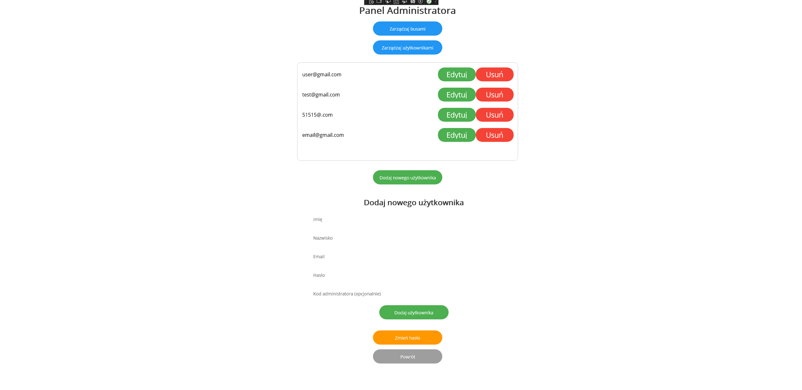
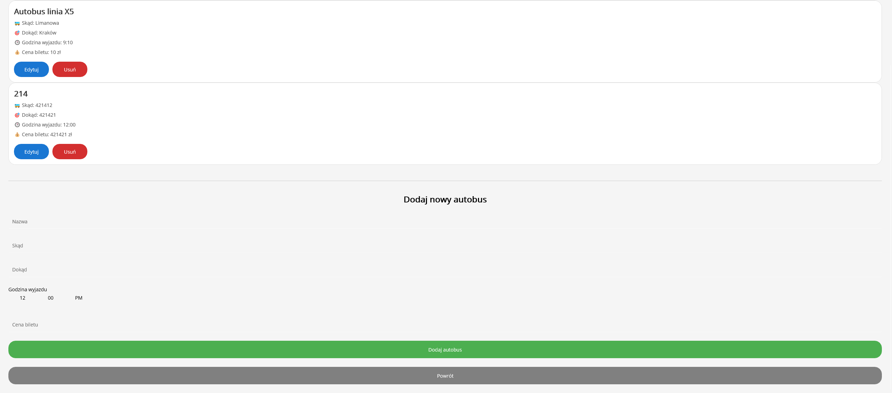

# 🚌 Aplikacja do zarządzania autobusami – .NET MAUI

Projekt stworzony w ramach nauki programowania aplikacji mobilnych w .NET MAUI. Umożliwia rejestrację i logowanie użytkowników, rozróżnianie ról (admin/użytkownik) oraz zarządzanie trasami autobusów (dodawanie, edycja, usuwanie).

---
## Dłuższa dokumentacja  
Pełna, szczegółowa dokumentacja projektu dostępna jest pod linkiem:  
[**Dłuższa dokumentacja**](README-longer.md)

---
## 📌 Spis treści

- [📸 Zrzuty ekranu](#-zrzuty-ekranu)
- [🔍 Opis funkcjonalności](#-opis-funkcjonalności)
- [⚙️ Technologie](#️-technologie)
- [📁 Struktura projektu](#-struktura-projektu)
- [🚀 Uruchamianie aplikacji](#-uruchamianie-aplikacji)
- [🛠 Przyszłe usprawnienia](#-przyszłe-usprawnienia)
- [👨‍💻 Autor](#-autor)
- [📄 Licencja](#-licencja)

---

## 📸 Zrzuty ekranu





---

## 🔍 Opis funkcjonalności

### 👥 Rejestracja i logowanie

- Rejestracja nowego użytkownika z podziałem na role:
  - **Użytkownik** – zwykły użytkownik
  - **Administrator** – dostęp do panelu zarządzania autobusami (wymaga specjalnego kodu)
- Bezpieczne hashowanie haseł z użyciem PBKDF2 + salt

### 🚍 Zarządzanie autobusami (panel admina)

- Przeglądanie listy autobusów
- Dodawanie nowej trasy
- Edytowanie danych trasy: nazwa, skąd, dokąd, godzina, cena
- Usuwanie trasy po potwierdzeniu

### 👤 Panel użytkownika

- Przeglądanie dostępnych tras autobusowych

---

## ⚙️ Technologie

- [.NET MAUI](https://learn.microsoft.com/en-us/dotnet/maui/)
- C#
- XAML (UI)
- SQLite (lokalna baza danych)
- PBKDF2 + Salt (hashowanie haseł)

---

## 📁 Struktura projektu

```
projekt/
│
├── Models/
│   ├── Bus.cs
│   └── User.cs
│
├── Pages/
│   ├── MainPage.xaml / .cs
│   ├── LoginPage.xaml / .cs
│   ├── RegisterPage.xaml / .cs
│   ├── AdminBusPage.xaml / .cs
│   └── UserPanelPage.xaml / .cs
│
├── Services/
│   ├── Database.cs
│   └── UserManager.cs
│
├── Resources/
│   └── (opcjonalnie style/grafiki)
│
├── App.xaml
└── AppShell.xaml
```

---

## 🚀 Uruchamianie aplikacji

### 1. Wymagania

- Visual Studio 2022 lub nowszy z zainstalowanym workloadem **.NET MAUI**
- Emulator Androida lub fizyczne urządzenie z USB debugging
- Opcjonalnie: SQLite Viewer (do podglądu lokalnej bazy)

### 2. Kroki

```bash
git clone https://github.com/twoj-login/projekt-autobusy.git
cd projekt-autobusy
```

- Otwórz plik `.sln` w Visual Studio
- Zbuduj projekt (`Ctrl + Shift + B`)
- Uruchom na emulatorze lub urządzeniu (`F5`)

---

## 🛠 Przyszłe usprawnienia

- Możliwość rezerwacji miejsc i zakupu biletu
- Filtrowanie tras po godzinach/miejscach
- Obsługa użytkowników zdalnie (np. przez REST API lub Firebase)
- Responsive design dla desktopów/tabletów
- Testy jednostkowe

---

## 👨‍💻 Autorzy

**Imię i nazwisko:** Krystian Koza
**Imię i nazwisko:** Mateusz Janiczek
**Imię i nazwisko:** Krystian Koza
**Rok szkolny:** 2024/2025  

---

## 📄 Licencja

Projekt edukacyjny – do użytku niekomercyjnego.

```
MIT License – Wolno kopiować, modyfikować i rozprowadzać z zachowaniem autora.
```

---

_Dziękuję za skorzystanie z aplikacji! Życzę szerokiej drogi! 🚍_
